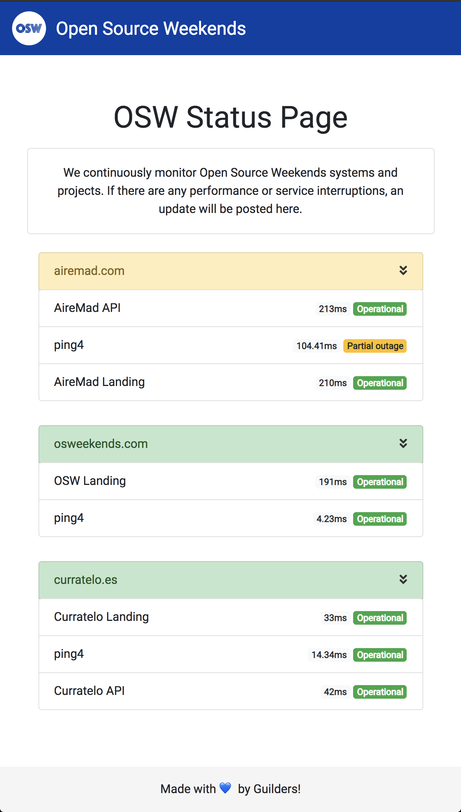

# https://status.osweekends.com

### Objetivo
Status de nuestros proyectos y servicios Online.

### Equipo: Guild 24
- [@koolTheba](https://github.com/koolTheba) Diseño y Frontend
- [@UlisesGascon](https://github.com/UlisesGascon) Backend, API y DB

### APP




### API 

**/api/v1/group**
Lista de todos los servicios

```
{
    "airemad.com": 
    [{
        "name": "AireMad API",
        "type": "Service",
        "severity": 8,
        "next_check": 1543263005.79,
        "last_state_change": 1543252008.527368,
        "output": {
            "raw": "HTTP OK: HTTP/1.1 200 OK - 336 bytes in 0.212 second response time ",
            "ping": "OK:",
            "rta_ms": 212
        },
        "state": {
            "value": 0,
            "host_state": "Up",
            "service_state": "OK"
        },
        "isActive": true
    }, {
        "name": "ping4",
        "type": "Service",
        "severity": 40,
        "next_check": 1543263044.710109,
        "last_state_change": 1543251925.556458,
        "output": {
            "raw": "PING WARNING - Packet loss = 0%, RTA = 104.30 ms",
            "ping": "WARNING",
            "rta_ms": "104.30"
        },
        "state": {
            "value": 1,
            "host_state": "Up",
            "service_state": "Warning"
        },
        "isActive": true
    }, {
        "name": "AireMad Landing",
        "type": "Service",
        "severity": 8,
        "next_check": 1543263009.11,
        "last_state_change": 1543251999.158572,
        "output": {
            "raw": "HTTP OK: HTTP/1.1 200 OK - 499 bytes in 0.211 second response time ",
            "ping": "OK:",
            "rta_ms": 211
        },
        "state": {
            "value": 0,
            "host_state": "Up",
            "service_state": "OK"
        },
        "isActive": true
    }]
    ...
```

**/api/v1/host**
Lista de todos los hosts

```
[{
    "name": "osweekends.com",
    "type": "Host",
    "severity": 8,
    "next_check": 1543263156.191384,
    "last_state_up": 1543263041.151251,
    "last_state_change": 1539264006.554773,
    "last_state_down": 1539263928.130967,
    "output": {
        "raw": "PING OK - Packet loss = 0%, RTA = 4.23 ms",
        "ping": "OK",
        "rta_ms": "4.23"
    },
    "state": {
        "value": 0,
        "host_state": "Up",
        "service_state": "OK"
    },
    "isActive": true
}, 
{...}]
```

**/api/v1/host/:host**
Los detalles de un host concreto, ejemplo `api/v1/host/osweekends.com`

```
{
    "name": "osweekends.com",
    "type": "Host",
    "severity": 8,
    "next_check": 1543263221.7694979,
    "last_state_up": 1543263164.249485,
    "last_state_change": 1539264006.554773,
    "last_state_down": 1539263928.130967,
    "output": {
        "raw": "PING OK - Packet loss = 0%, RTA = 4.24 ms",
        "ping": "OK",
        "rta_ms": "4.24"
    },
    "state": {
        "value": 0,
        "host_state": "Up",
        "service_state": "OK"
    },
    "isActive": true
}
```


### Variables de entorno

- `ICINGA_SERVER` Ruta del sistema remoto (Icinga2), ejemplo `https://domain.com/icinga2/api`
- `ICINGA_USER` Usuario del sistema remoto (credenciales Icinga2)
- `ICINGA_PASS` Password del sistema remoto (credenciales Icinga2)
- `PORT`: Puerto de salida de esta aplicación